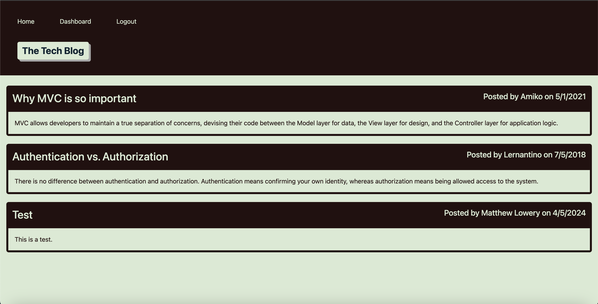

# MVC Tech Blog

## Description
For this project, we had to create a CMS-style blog using the MVC structure. This was one of the more difficult projects I've had to work on. It took a lot of time and patience to get this to the state it is in now. Unfortunately, I wasn't able to get all the required functions working, such as being able to edit and delete posts, as well as successfully posting, editing, and deleting comments. In the future, I'd like to spend more time refining this project to get it to a more acceptable state.

There's no link included because I tried to get this to run in Render, but I kept running into the same error:

ConnectionRefusedError [SequelizeConnectionRefusedError]: connect ECONNREFUSED 127.0.0.1:5432
    at Client._connectionCallback

If this means I fail the class, I apologize, and I will pay the remaining amount required.

## Screenshot

